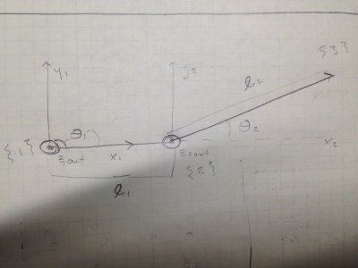
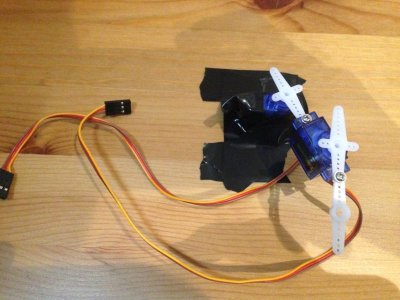

## Intro
- If we want to control the robot through imitation learning, we need the ability to manually control it so as to gather data 
- Manual control requires programmatic control, i.e., the ability to specify end-effector positions and have the robot achieve those positions through changes in joint configurations
- This post shows how to implement programmatic control of a simple two-link robot

## Outline
- Programmatic robot control
    + Forward kinematics
    + Inverse kinematics

## Preview
<iframe width="560" height="315" src="https://www.youtube.com/embed/vHgpbdHIV50" frameborder="0" allow="autoplay; encrypted-media" allowfullscreen></iframe>

## Materials 
- This post only uses materials from previous posts

## Background 

### Forward Kinematics
- We're focused on robotic manipulators aka robot arms, where the end of the robot arm is called the end-effector
- Given all the information about a robot arm (length and mass of the links, the types of joints, how those joints and links are connected, etc) and the current configuration of the joints, how can you find out where the end-effector is?
    + [Forward kinematics](https://en.wikipedia.org/wiki/Forward_kinematics) answers this question

#### Schematic
- First, draw a schematic of the robot arm, assigning frames to the different joints
- Figure 3 in these [notes](http://www.cs.columbia.edu/~allen/F15/NOTES/jacobians.pdf) provides a schematic for a two-revolute-joint robot (called an revolute-revolute (RR) manipulator)
    + revolute means the joint rotates, and the other option is prismatic meaning it translates linearly along its axis
    + Also, here's a schematic with the frames labeled



#### DH Parameters
- Second, derive [Denavit–Hartenberg parameters](https://en.wikipedia.org/wiki/Denavit%E2%80%93Hartenberg_parameters)
    + DH parameters are one convention for expressing information about robotic manipulators
    + They make it easy to derive the transformation from each frame to the end-effector frame

#### Transformation Matrix
- Given the DH parameters, we can derive a transformation matrix from each frame to the frame of the end-effector
    + First, build transformation matrices from each frame to the next 
    + Second, multiply these all together to find the transformation from the 0th frame to the end-effector frame
- Section 3 of the referenced [notes](http://www.cs.columbia.edu/~allen/F15/NOTES/jacobians.pdf) provides the transformation matrix for the RR manipulator
- Here's the [code](https://github.com/wulfebw/robotics_rl/blob/master/rlrobo/dh.py) for computing the transformation matrix given the DH parameters

### Inverse Kinematics
- We just looked at the forward kinematics, which tell you the position of the end-effector given the configuration of the joints
- What about the opposite question: given a (desired) position of the end-effector how do you figure out the joints that achieve that position?
- This turns out to be a more difficult problem to solve
    + Since the forward kinematics involve nonlinear operations (sine, cosine), typically there's no analytical solution for the joints
    + There can be many solutions, and there can also be no solutions
    + We'll look at one method for solving the problem
    
#### Jacobian
- The method we'll use requires the Jacobian
- The forward kinematics map from the joints config to the end-effector position
    + It's a function mapping from dimension n to dimension m 
    + If you differentiate each output with respect to each input, and arrange those derivatives in a matrix, that matrix is the [Jacobian](https://en.wikipedia.org/wiki/Jacobian_matrix_and_determinant)
- Given the transformation matrices, there's a simple algorithm for finding the Jacobian
- The code implementing the algorithm and along with a description can be found [here](https://github.com/wulfebw/robotics_rl/blob/master/rlrobo/jacobian.py)

#### Inverse Jacobian Method
- The method we use for solving the inverse kinematics problem is called the inverse Jacobian method 
    + It's an iterative method that 
        * Linearizes the function using the Jacobian
        * Solves for the change in joint configuration that moves the end-effector closest to the target position
            - This is accomplished by formulating the pseudoinverse of the Jacobian, hence the name
        * Updates the configuration 
        * Repeats until the target is reached or it's determined that it cannot be reached
    + [Here's](https://inst.eecs.berkeley.edu/~cs184/fa09/resources/ik.pdf) a solid tutorial on it that steps through the logic and math
    + [Here's](https://github.com/wulfebw/robotics_rl/blob/master/rlrobo/inverse_kinematics.py) my implementation of it
- This method does not explicitly deal with constraints on the movement of the manipulator 
    + A faster solver that handles constraints will be the topic of a future post

## Walkthrough

### Hardware
- The two-link manipulator is just the connected servos from the previous post, which looks like:


### Software
- Download and setup the project code

```bash
git clone https://github.com/wulfebw/robotics_rl.git
cd robotics_rl
sudo python setup.py develop
```
- Run the tutorial [code](https://github.com/wulfebw/robotics_rl/blob/master/tutorials/3_two_link_programmatic_control.py) that randomly samples an end-effector position, and then solves for a joint configuration to achieves that position

```python
import time
import rlrobo.manipulator

manipulator = rlrobo.manipulator.build_RR_manipulator(l1=1,l2=2)
while True:
    pos = manipulator.random_position()
    manipulator.set_end_effector_position(pos)
    time.sleep(1)
```

## Result
<iframe width="560" height="315" src="https://www.youtube.com/embed/vHgpbdHIV50" frameborder="0" allow="autoplay; encrypted-media" allowfullscreen></iframe>
