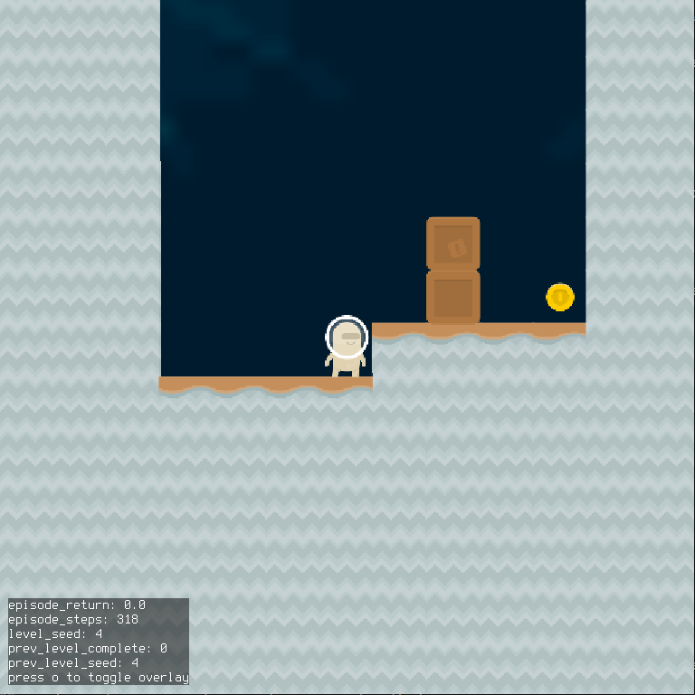
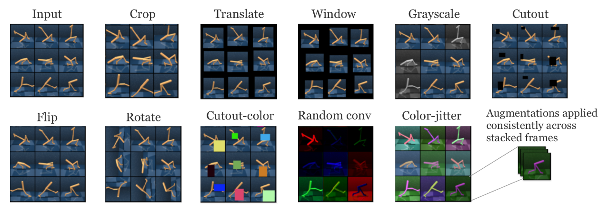
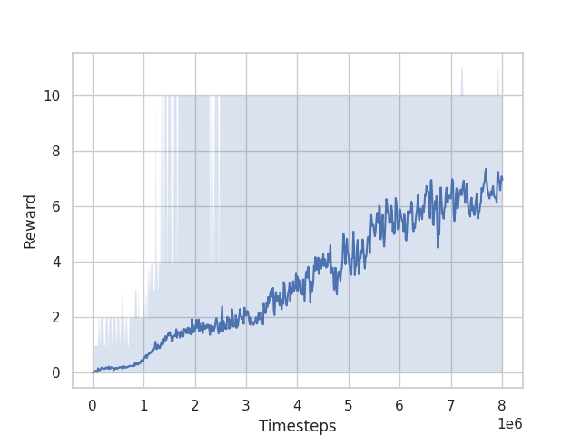
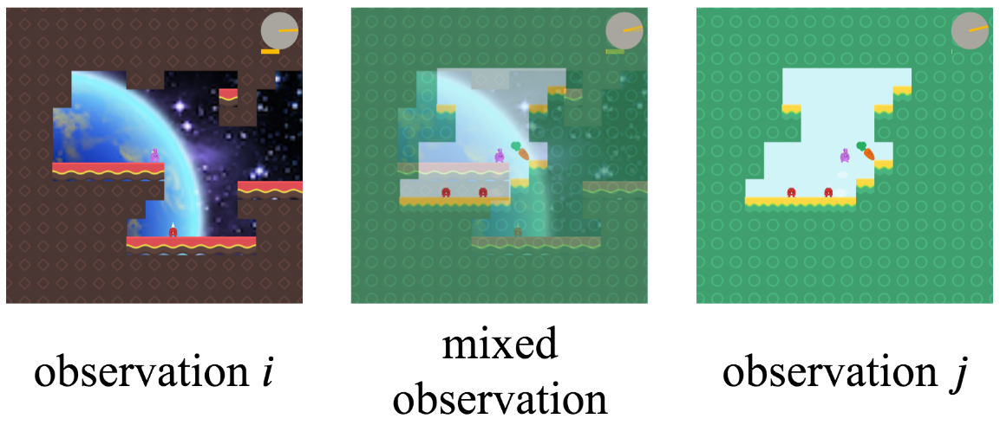

## Introduction
- I participated in the [NeurIPS 2020 Procgen Challenge](https://www.aicrowd.com/challenges/neurips-2020-procgen-competition) with my colleague, Adrien Gaidon, and ended up winning the competition (1st place in the sample efficiency track, 2nd place in the generalization track).
- This post describes the process I followed, the methods I tried, and lessons learned from the competition.
- Here's a brief video giving an overview:
<figure style="text-align:center;">
    <iframe width="560" height="315" src="https://www.youtube.com/embed/RwEqFuc6Qt0" frameborder="0" allow="accelerometer; autoplay; clipboard-write; encrypted-media; gyroscope; picture-in-picture" allowfullscreen></iframe>
</figure>

## Background
- The competition evaluates reinforcement learning agents on the [Procgen environments](https://github.com/openai/procgen).
  + There are two tracks:
    * Sample efficiency: For each env, train and evaluate on the full distribution of levels.
    * Generalization: For each env, train on 200 levels, and evaluate on the full distribution.
  + Participants submit code to train agents. Agents are trained for each environment, and the scores across environments are aggregated to get the final score.
    * The final evaluation is on 16 public environments (this counted for half the score), and 4 private environments (the other half of the weight in the score).
    * The agents only have 8 million steps in the environments during training, and can only run training for at most 2 hours

## Process
### For deciding which method to try next
This is basically "use the scientific method", but there are a couple aspects specific to RL:
1. Evaluate the performance of the current best approach
   - Plotting learning curves on train / evaluation levels
   - Visualizing the policy at different points during training
     + Watch the policy and try to understand why it doesn't perform better / where it gets stuck / killed
2. List all the reasons the agent might be performing suboptimally in a given environment or across environments
   - See Appendix 1 for an outline of reasons
   - This often involves doing a literature review / looking for relevant papers
3. Choose a reason, and design an experiment to check if that really is the reason
   - Often the experiment is trying out some method to address the problem
4. Repeat


### For checking whether an approach is implemented correctly
- This is the process I followed after implementing an approach / method to check if I implemented it correctly
  + In RL it's often difficult to tell if you correctly implemented something because often the agent will perform well / behave reasonably even if the method is implemented incorrectly
    * The extent to which this is the case varies based on what you're implementing (e.g., getting the training algorithm wrong will generally be more noticeable than getting an exploration strategy wrong)
    
1. Run training on a single, easy level in Coinrun
   - I found an easy training level by sequentially going through the levels on Coinrun:
     ```bash
     python -m procgen.interactive --env-name coinrun --level-seed 4 --distribution-mode easy
     ```
   - The level just involves learning to move to the right:
     <figure class=img-fig>
        
     </figure>
   - Run training for ~5 minutes and if the agent hasn't learned to move right, then assume there's a bug
     + This works when using PPO, but it doesn't work when using some other methods
       * DQN is particularly slow to learn early in training, so it can take much longer to pass this sanity check when using it

2. Run training on multiple levels of Coinrun
   - I used Coinrun because it's probably the easiest environment
   
3. Run training on all (or relevant subset) of envs

### For running experiments
- The competition is based on the [rllib package](https://docs.ray.io/en/master/rllib.html), which is built on top of [ray](https://docs.ray.io/en/master/index.html), so I used ray for running hyperparam searches / experiments.
  + ray tune has a [`run_experiments`](https://simon-ray.readthedocs.io/en/doc-new-theme/tune/api_docs/execution.html#tune-run-experiments) function, that runs a set of experiments, where those experiments can be specified as a set of configuration files
  + So I basically wrote a script to generate the configuration files for experiments I want to run
    * [Here's](https://github.com/wulfebw/neurips2020-procgen/blob/master/multi_train.py) the script
      - The script uses a [(named) cross product](https://stackoverflow.com/questions/9098194/name-parts-of-iterables-in-itertools-products) for grid searches:
        ```python
        from itertools import product, starmap
        from collections import namedtuple

        def named_product(**items):
            Product = namedtuple('Product', items.keys())
            return starmap(Product, product(*items.values()))
            
        ...
        def sample_configs(...):
            parameter_settings = named_product(
                learning_rate=[1e-4, 1e-3],
                num_sgd_iter=[1, 2],
                ...,
            )
        ```
        + This gives a `namedtuple` object for each set of parameters, which helps simplify the code
      - I also organized hyperparameters into different classes, which helps when dealing with a large number of hyperparameters
      
## Approach
### Methods used in the solution we submitted
- This section covers the approach we ended up using in the winning solution
- There were four main categories of methods we used: 
#### RL algorithm
- We used [Phasic Policy Gradient (PPG)](https://arxiv.org/abs/2009.04416)
  + PPG is basically an extension of [PPO](https://arxiv.org/abs/1707.06347) that's more sample efficient
    * It's more sample efficient because it performs more updates with a given batch of data than PPO (though only to the value function), and because it avoids or minimizes gradient interference between the gradients from the policy and value objectives
  + See the paper for details since it's presented clearly there
- We used the single-network variant of PPG to improve computational efficiency
  + This is because of the 2-hour time limit for training
  + In the paper, they detach the value head (during policy updates) when using a single network, but we found this resulted in some instability (e.g., the network would collapse in some envs)
    * They mention they were worried about this in the paper, but that it wasn't a problem for them
    * My guess is that changes to other hyperparameters resulted in it causing problems for us
    * Instead of detaching the value head, we just reduced the value loss coefficient
- We [implemented](https://github.com/wulfebw/neurips2020-procgen/blob/master/algorithms/data_augmenting_ppo_agent/sync_phasic_optimizer.py) PPG in rllib by implementing a new `PolicyOptimizer` subclass
  + It just stores the states and value targets in a buffer, and runs the value / auxiliary epochs occasionally
  
#### Data augmentation
- We originally used data augmentation to improve generalization performance, but it turned out that it also improved sample efficiency
  + I believe the reason for this is that the data augmentation prevents overfitting to the levels observed so far
  + This results in the policy generalizing better to unseen levels it encounters during training
  + As a result, it performs better in the environment more quickly, which allows it to learn about the optimal policy more quickly
- We tried the methods from this [paper](https://arxiv.org/abs/2004.14990)
  + Here's a graphic from the paper showing the effect of the augmentations
    <figure class=img-fig>
      
    </figure>
  + We ultimately ended up using the random translation augmentation
    * This worked well in most environments
    * Some augmentations worked better in certain environments, but would hurt performance in others
- The random translation code need to run quickly due to the 2-hour time limit, so I ended up implementing it manually instead of using `numpy.roll` or something similar
  + The implementation is pretty ugly, so I won't include it (see [here](https://github.com/wulfebw/neurips2020-procgen/blob/master/algorithms/data_augmentation/data_augmentation.py)), but it ended up being about 4x faster than `numpy.roll` (there might be a more suitable function in numpy, but couldn't find one)

#### RL tricks
- We tried the RL tricks from this [paper](https://arxiv.org/abs/2005.12729)
  - That paper focuses on continuous control tasks, but we figured the results would likely transfer
  - They found that reward normalization was the most important implementation detail
  - And that's also what we found, and ended up using only that change
  - In the paper, they discuss the options for normalizing rewards
    - The most obvious thing to do is to normalize the reward values themselves by subtracting their mean and dividing by their standard deviation
      - The main issue with this is that the goal is for the target-being-predicted (i.e., the state-value) to be normalized
        - But normalizing the rewards individually doesn't accomplish this
          - For example, if you assume the normalized rewards are distributed normally with zero mean and unit variance, then their sum will be normally distributed with zero mean, but with variance [the sum of the individual variances](https://en.wikipedia.org/wiki/Sum_of_normally_distributed_random_variables)
          - So instead, you would ideally normalize the returns using their mean / variance
            - This is approximately the approach taken by the [PPG paper](https://github.com/openai/phasic-policy-gradient/blob/master/phasic_policy_gradient/reward_normalizer.py#L59)
              - They do something where they reverse-discount the observed rewards (see the link for an explanation), which I don't fully understand
              - I just computed the variance of the discounted returns, and divided by that ignoring the discount factor
                - I'm not sure why they take their approach instead of just doing this
                - One reason might be that early on (in the rollouts) you don't know what the returns are, so how do you normalize by their statistics?
                  - I just ignored this problem, but it's possible their approach addresses it
      - The second issue is that you generally do not want to change the mean of reward values in reinforcement learning
        - The justification being that (mean-normalizing rewards), ["affects the agent's will to live"](http://joschu.net/docs/nuts-and-bolts.pdf)
          - For example, if all the rewards are initially positive, then an agent is incentivized to avoid terminal / absorbing states
          - But if you mean-subtract the rewards, then the agent may be incentivized to seek out terminal / absorbing states (depending on whether it's encountering negative rewards)
    - So ultimately I ended up with something along the lines of:
      ```python
      def normalize_rewards_running_return(policy, rewards, eps=1e-8):
          """Updates reward statistics, and normalizes rewards by their standard deviation.
            
              Args:
                  policy: The policy being optimized
                  rewards: Numpy array of reward values
                  eps: Value to add to denominator to avoid numerical issues
              
              Returns:
                  Normalized rewards
          """
          # Implements Welford's Algorithm (https://en.wikipedia.org/wiki/Algorithms_for_calculating_variance)
          policy.reward_stats.update(rewards)
          return rewards / (policy.reward_stats.std + eps)
      ```
    - The OpenAI [implementation](https://github.com/openai/phasic-policy-gradient/blob/master/phasic_policy_gradient/reward_normalizer.py#L59) computes a single variance across workers
      - I just ignored this aspect and it seemed to work fine
      
- The second RL trick we used was disincentivizing no-op actions
  - A lot of the environments in Procgen have no-op actions (i.e., actions that when taken have no effect)
    - Since the agent is limited to 8 million steps, taking no-op actions makes the agent less sample efficient (it basically wastes samples)
  - To disincentivize no-op actions, we checked for cases where the observation (i.e., image) didn't change across timesteps
    - You could argue that this is taking advantage of a limitation of the Procgen environments, which is that they don't resemble natural images, which would (likely) never have duplicate images across timesteps
      - In the real-world case, you have to do something more complicated, for example using some more general [intrinsic motivation method](http://people.idsia.ch/~juergen/creativity.html)
        - From this perspective, penalizing no-ops is basically an efficient, environment-specific, intrinsic motivation strategy
  - One environment where it helps a lot is in Miner
    - In this case, the agent learns not to run into walls / bricks that won't move
    - But it also learns to rapidly switch between states rather than remain stationary
  - A problem with this approach is that it doesn't work for environments where the image changes despite no-op actions
    - For example, in Chaser the image changes because the environment has the chasing agents moving around
      
#### Hyperparameter tuning
- Hyperparameters have a large impact on the performance of RL algorithms
  - PPO is actually less sensitive to hyperparameter values than other algorithms like DQN, but they still matter
- Tuning hyperparameters properly requires a lot of time and/or resources
  - To reduce the cost, I generally assumed that hyperparameters were independent whenever reasonable
  - I also ran hyperparamter tuning throughout the competition, tuning only one or two hyperparameters are once to check whether some newly-implemented method improved performance
    - As a result, the final hyperparameters were likely suboptimal / outdated
- This table gives the values of hyperparameters that differ from the default values from the [Procgen](https://arxiv.org/abs/1912.01588) paper and that I think are important

|Hyperparameter | Value|
|:--------------|-----:|
|Network Architecture| Impala (32, 48, 64)|
|Rollout Fragment Length | 16|
|Number of Workers | 7|
|Number of Envs per Worker | 125|
|Minibatch Size| 1750|
|PPG Aux Loss Every k| 32|
|PPG Aux Loss Number of Epochs | 2|
|Value Loss Coefficient | 0.25|
|Framestack | 2|
|Dropout Probability | 0.1|
|No-op Penalty| -0.1|

###### 
- Some comments on these hyperparameter values:
  - The **number of workers** and **number of envs per worker** were set to minimize training wall clock time
  - The **rollout fragment length** was set to a much smaller value than that of the original paper (16 versus 256)
    - The reason being that I wanted the data in each minibatch to be as uncorrelated as possible, and having a small rollout fragment length allowed for running a large number of environments in parallel, which results in less correlated data
    - This mainly seemed to improve consistency of the algorithm, but it also improved performance a great deal on one of the private environments (graph downloaded from submission (since the environment is private), but it's from the `Safezone` environment, which other teams reported difficulty with):
        <figure class=img-fig>
          
        </figure>
      
  - The **network size** and **minibatch size** were tuned jointly over the course of the competition to balance training time and performance
  - The **value loss coefficient** was set lower than typical to account for not detaching the value heading (as discussed in the PPG section)
  - Using a nonzero **dropout probability** improved performance (surprisingly, because dropout typically slows down training a lot)
    - The main reason I can think of for why this would be the case is that might improve generalization to new levels sufficiently to compensate for the increase in training time

### Other methods we tried that didn't improve performance
#### Algorithms
- We also tried DQN / [Rainbow](https://arxiv.org/abs/1710.02298), and [Soft Actor-Critic](https://arxiv.org/pdf/1801.01290.pdf), and couldn't get either to perform better
  - These methods should in theory be more sample efficient because they can reuse the data to a larger extent
    - This is because both are off-policy methods
  - Rainbow also implements a variety of methods that should improve performance
    - For example, [Noisy Nets](https://arxiv.org/abs/1706.10295), [prioritized experience replay](https://arxiv.org/abs/1511.05952), [distributional RL](https://arxiv.org/abs/1707.06887)
- We got DQN to work on some envs, it just required a lot more experience / very slow training (e.g., large target network update interval, small learning rate, etc)
  - This matches the result from the Procgen paper
    - They give a possible explanation for DQN's poor performance
      - Which is basically that the diversity of the levels for each environment gives DQN trouble
    - Why DQN has more trouble with diverse environments than e.g., PPO I'm not sure
- I think that if you removed the time constraint (two hours) on the training time (while still constraining to 8 million time steps), these methods should be able to achieve better performance
  - But given the time constraint, PPG performed better because it already reuses the data to the maximum extent possible (approximately)
    - This is the main advantage of PPG: that it gives a way to make PPO more sample efficient through greater sample reuse
    
#### Exploration
- In many of the environments, dithering exploration strategies are quite poor
  - For example, in the Heist environment, a dithering exploration strategy takes a very long time to solve many levels
  - Another example is that in many levels, a single random action can result in the agent being killed
    - e.g., Chaser, Miner, Leaper, etc

- We implemented [Noisy Nets](https://arxiv.org/abs/1706.10295), but for the policy gradient case
  - This poses a few challenges for PPO
    - For example, adding noise to the policy output when sampling results in the training policy being different from the sampling policy
      - Since the PPO update implicitly constrains the policy to not change to much, the additional change due to the noise makes the policy update less efficient
    - You can get around this issue somewhat by maintaining the same noise vector during sampling as during updating
      - The problems with this are that maintaining that noise vector is fairly complicated in RLLib, but more importantly with noisy nets that means different samples in each batch might have different fully connected weights
        - And running a forward pass with different weights is extremely inefficient (depending somewhat on which weights change)
  - As a result of those challenges, we couldn't get noisy nets to improve performance
- An alternative to Noisy Nets for improving exploration that uses approximately the same intuition (that dithering strategies are worse than temporally-coherent exploration) that works better with PPO is [variational options](https://arxiv.org/pdf/1807.10299.pdf)
  - These methods basically all introduce some sort of latent variable as input to the policy
  - And the policy is rewarded for having the latent variable have high mutual information with the future state-action pair(s)
  - The result is that you can reduce dithering in the policy (e.g., by reducing or removing the entropy bonus), and only rely on the noise in the latent variable sampling to provide exploration
    - The problem with this for PPO/PPG is, first, that the entropy bonus serves to make the policy update more stable (so getting rid of it makes the algorithm less stable)
    - And, second, it doesn't make sense to deterministically select actions for PPO when sampling rollouts
      - The result is that you keep the random action sampling, which diminishes the effect of the variational option because you're still employing dithering exploration

#### Form of the policy / model
##### Accounting for partial observability
- Some of the environments are partially observable even when provided with the last ~4 frames
  - For example, Jumper requires remembering when you last jumped
  - Another example is that caveflyer may require you to remember where you've already explored for the exit
- To account for this partial observability, we tried out a recurrent policy
  - This slowed down learning relative to the CNN policy to the extent that accounting for the partial observability wasn't worth it

##### Object-based inductive bias
- An idea we tried out early on was to encode an object-based inductive bias
  - For example, we tried having the model feature extraction use the model from [MONet](https://arxiv.org/abs/1901.11390) or [C-SWM](https://arxiv.org/abs/1911.12247)
- The intuition behind this is that, all the environments involve a relatively small set of interacting objects (small relative to number of pixels)
  - If we can represent the state as a set of objects and relationships between them instead of as pixels, we should be able to learn more efficiently
    - Because that object-based representation of the state is much lower-dimensional
    - Because the object-based representation encodes some invariances that don't exist in the image representation
- This didn't work because the object representations that were learned didn't correspond to the objects relevant for planning
  - For example, the "objects" discovered by these algorithms were generally the foreground and background of the image instead of e.g., the different agents in the scene
    - This makes sense when using an objective based on e.g., reconstructing the observation and not on planning performance
    - But even when using the RL objective exclusively, the object representations learned weren't useful

#### Data augmentation
- We tried automatically deciding which data augmentation to use using a multi-arm bandit algorithm
  - This approach was proposed in this [paper](https://arxiv.org/abs/2006.12862)
  - The approach worked in the paper when they were using 25 million steps, but we found that using 8 million steps wasn't enough to consistently find the best augmentation
- We also tried [Mixreg](https://arxiv.org/abs/2010.10814)
  - This method augments the data by forming a convex combinations of observations and their outputs
    - Here's an example taken from the paper:
      <figure class=img-fig>
          
      </figure>
    - The intuition being that it should result in augmented data that more closely resembles unseen states than other augmentation methods
    - We found that it didn't work as well as just random translation

## Lessons
This section covers some miscellaneous lessons learned

### About RL competition strategy
#### 1. Avoid overfitting to the leaderboard (when it's not the test set)
- At the end of the competition I was 7th on the leaderboard, but ended up getting 1st
  - The leaderboard was determined based on six public environments, whereas the final ranking was based on the full set of sixteen public environments
- I suspect part of the reason for this was that some of the other teams were overfitting to the leaderboard (e.g., choosing their algorithm based only on the environments considered by the leaderboard)
  - This is a reasonable strategy if you don't have much compute resources to use to evaluate performance across all environments, but should be avoided if possible

#### 2. Optimize for performance on private environments
- The scoring for the competition was `0.5 * public score + 0.5 private score`
- The public score was based on 16 envs, whereas the private score was based on 4 envs
- So everything else being equal it's better to improve performance on the private envs
- Since the leaderboard leaked information about performance on the private envs this was possible
  - There were a few cases where the best hyperparameters on the public envs were different than on the private envs, and I went with the values best on the private envs
  
### About RL competitions
#### 1. RL competitions are largely about engineering as opposed to performing novel research
- There is a huge design space for RL algorithms
  - By this I mean that a large number of methods exist, and it's unclear without trying them out what will work best
  - Just implementing these existing methods is (a) time consuming and (b) likely to yield "state-of-the-art" performance
- Implementing existing algorithms is also much lower risk than trying to develop a new algorithm with respect to competition performance
  - Highly-novel algorithms often require a few iterations of improvements before they outperform existing methods
- RL algorithms can be heavily compute-optimized, and RL competitions often require some computational limitations
  - There's similarly a large design space / number of options to optimize performance (e.g., how samples are stored, lower-precision training, etc)
- For those reasons, I'm not sure RL competitions are a good way to promote the discovery of novel algorithms
  - Which is largely the motivation for competitions hosted as part of conferences
- Counter arguments:
  - Supervised learning competitions have been shown to be effective at promoting novel research
    - E.g., ImageNet
  - It's possible there just wasn't enough interest in this competition
    - As a result, novel solutions weren't necessary to win
    - But it's possible that if there was greater interest that novel solutions would be required
    
#### 2. RL competitions are a good way to find out how well existing methods can solve a task
- While they may not be great at promoting novelty, they are good at finding out how well existing methods can perform
  - This is because they get a lot of people trying out different combinations of existing methods
    - i.e., they help cover the large design space
- In the case of the Procgen competition, the performance of the best approaches was better than the baseline performance by a surprising amount

#### 3. The Procgen benchmark promotes general approaches
- Early in the competition I tried a number of methods that were motivated by improving performance in a single environment
- For almost all these methods, it turned out that while they improved performance in one environment, they hurt performance in the others
- This makes me think that the diversity of environments in Procgen does a good job of favoring general-purpose methods over environment-specific ones, which I think is an important quality in an RL benchmark

#### 4. Working with multiple people in a competition has a lot of advantages
- This one is a bit obvious, but just including it for my future reference

## Appendices 
### Appendix 1: Reasons for suboptimal performance
- Here's an outline of reasons the agent might be performing suboptimally.
- This categorization is not perfect:
  + It conflates (i) problems, (ii) root causes of problems, and (iii) solutions to those problems.
  + It would be better organized as a graph with cycles instead of as a tree, because different problems can have the same cause.
- It's a work in progress.

1. Reinforcement Learning Algorithm
   - Suboptimal exploration
     + Inefficient exploration due to no-op actions
     + Lack of entropy regularization
   - Policy optimization
     + High-variance updates
       * Minibatch contains highly-correlated data
         - Number of parallel envs / works is too small
         - Rollout fragment length is too long
       * Minibatch size too small
       * Discount factor is too large
       * Lack of reward normalization
     + High-bias updates
       * Rollout fragment length is too short
       * Bootstrap value function estimate poor
     + Optimization objective doesn't reflect true objective
       * Entropy regularization is too strong
   - Value optimization
     + target values are not normalized
       * Due to a lack of reward normalization
     
2. Model
   - Forgets previously-learned information, or learns slowly
     + Limited model capacity
     + Large weight updates
       * Lack of gradient clipping
       * Lack of reward normalization
       * Due to rare events in the environment with high reward value
     + Gradient interference
       * Sharing policy and value networks
     + Internal covariate shift
       * Lack of batch normalization 
   - Insufficient / incorrect inductive bias
     + Image-related issues
       * Overly dependent on texture
       * Overly dependent on color
     + Lack of invariance to reasonable transforms
       * Poor or insufficient data augmentation
   - Partial observability
     + Lack of sufficient observation history
       * Frame stacking insufficient
       * Form of the model insufficient (e.g., should use RNN instead)
     + Previous action required 
     + Timestep required

3. Optimization
   - Suboptimal optimizer
     + SGD variants
   - Poor gradient clipping
     + Clipping by global norm slows down learning too much
     + Clipping elementwise prevents learning optimal behavior
   - Learning rate is too high

4. Generalization
   - Lack of invariance to irrelevant changes
   - Invariance too strong
   
