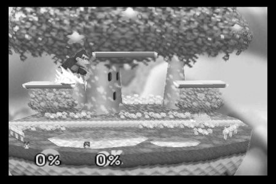

### Summary
The existing Nintendo 64 Reinforcement learning environments have some disadvantages. [Gym-Retro](https://github.com/openai/retro) can almost support N64 emulation, but not quite. I made some changes to the Gym-Retro code to allow for N64 environments. This post describes some of the challenges in doing that, initial results in training an agent in Super Smash Bros. 64, and next steps.

- You can find the code [here](https://github.com/wulfebw/retro).
- Here's an example of an RL agent (Pikachu) playing the game AI (level 9 DK):
<figure style="text-align:center;">
    <iframe width="560" height="315" src="https://www.youtube.com/embed/xlh6xhtkBRY" frameborder="0" allow="accelerometer; autoplay; encrypted-media; gyroscope; picture-in-picture" allowfullscreen></iframe>
</figure>

### Environment
#### Motivation
There are some existing N64 RL environments. [Gym-Mupen64Plus](https://github.com/bzier/gym-mupen64plus) is the main one. It works by running an N64 emulator, taking screenshots of the game, and parsing the screen to compute rewards. This has some issues. First, it means that the environment runs at a variable rate with respect to the agent (i.e., the time between taking an action and having it enacted in the environment is variable). Second, parsing the screen is brittle and not scalable (to more games) compared with reading values from RAM. Third, the screen-shotting mechanism has some disadvantages, for example it's difficult to run multiple environments at once.

The goal of this project was to implement an RL environment for N64 that didn't have these issues, and that operated like a typical gym environment.

#### Challenges
When I started, I considered a few options for implementing the environment, and settled on adapting the [Gym-Retro](https://github.com/bzier/gym-mupen64plus) codebase to allow for N64 emulation. I wasn't sure when I started why Gym-Retro didn't already support N64 games. It turns out the main reasons for that are (i) N64 uses dynamic memory locations for game data, and Gym-Retro is implemented assuming static memory locations and (ii) emulating N64 visuals requires adding OpenGL support (and even with this support emulation is fairly slow).

##### N64 Emulation
Gym-Retro incorporates the console emulators (called "cores", borrowing [libretro](https://www.libretro.com) terminology) as subrepos using [git-subrepo](https://github.com/ingydotnet/git-subrepo). I took this same approach, and added [Mupen64Plus-Next](https://github.com/libretro/mupen64plus-libretro-nx). This seemed to be the most actively developed libretro N64 core.

##### N64 dynamic memory
N64 games (at least Super Smash Bros. 64) store data in memory in dynamic locations, but the address of that data is stored in a constant location. For example, the health of player one might be stored (approximately) anywhere in the block of RAM from `0x80000000` to `0x88000000` (see [details](https://en.wikibooks.org/wiki/N64_Programming/Memory_mapping) on N64 memory map); however, the pointer to this health value is always stored at `0x80000000` + `0x000A50E8` + `0x00000020` + `0x0000004C`. 

Gym-Retro isn't designed for this sort of dynamic memory lookup, which is (I believe) partially why N64 wasn't supported. In order to handle this, I (approximately) copied the approach taken by [BizHawk](http://tasvideos.org/BizHawk.html) of having a separate memory perform the data lookup, but implemented this in python instead of c++. One subtle aspect to this is that the data pointers refer to absolute locations in memory, but the memory available is just the RDRAM section of size `0x08000000`. So reading a location in memory ends up looking like:
```python
# Skipping the rest of the class...
def read_address(self, ptr):
    self.assert_valid_ram_address(ptr)
    addr_list = self.ram[ptr:ptr + self.addr_size]
    abs_addr = convert_byte_list_to_int(addr_list)
    rel_addr = abs_addr - self.rambase
    self.assert_valid_ram_address(rel_addr)
    return rel_addr
```
I copied this approach from [ScriptHawk](https://github.com/Isotarge/ScriptHawk).

##### OpenGL
The second challenge in supporting N64 in Gym-Retro is that the N64 libretro core requires that the libretro frontend provide OpenGL support. This requires some effort to implement, but it also means that the environment will be fairly slow to simulate because rendering 3d graphics (even using OpenGL) is slower than rendering the 2d graphics used in the supported cores (like Atari). I know next to nothing about OpenGL, so I basically copied the minimal libretro frontend code from [sdlarch](https://github.com/heuripedes/sdlarch) into the Gym-Retro emulator class (though adapted it to use [GLFW](https://www.glfw.org/) instead of [SDL](https://www.libsdl.org/release/SDL-1.2.15/docs/html/guidevideoopengl.html) because GLFW provided all the functionality I needed and is a lot smaller and could be directly incorporated into the project as a subrepo).

Even though I just copied the sdlarch code into the emulator, it took some effort to figure out where everything should go. I couldn't find much documentation on how to implement a libretro frontend with OpenGL support online.

#### Conclusion
The end result is an N64 RL environment using Gym-Retro. Running 16 environments in parallel (on 8 cores) I'm able to get 45 frames per second. This is much slower than, for example, [procgen](https://github.com/openai/procgen), which can apparently simulate "thousands of steps per second on a single core". This might be part of the reason OpenAI moved away from retro to procgen (in addition to the generalization properties of procgen). 

### Initial Experiments
After getting the environment running I ran some initial experiments to make sure it works. These are "initial" in that they involve training against the game AI instead of self-play.

#### Environment Setup
For these initial experiments, the environment is set up for a single match between Pikachu (the controlled agent) and a level 9 DK. DK acts deterministically (I wasn't sure about this beforehand, but this is clear from the results), though items are included and occur randomly. Since DK's behavior is determined by the items, DK also acts randomly, though in practice this doesn't matter much.

- Observation space is a stack of two color images. I started with grayscale images, but the agent didn't perform well, I believe because Pikachu blended into the background too much. I think four frames would help since two frames seems not quite Markovian, but using four color frames slowed down training a fair amount. I also used color images because they might make it easier to identify items.

<figure>
  
  <figcaption>Where's Pikachu?</figcaption>
</figure>

- Action space is a multi-discrete space: two dimensions for directional and one for the button press. I could have alternatively used a multi-class action space, but it would have come out to be size 36, which seemed fairly large.
- Reward Function is +1 for killing DK, -1 for dying, +damage dealt / 100. I initially started with -damage received / 100, but that resulted in too much avoidance behavior.

I chose DK as the opponent because the goal is ultimately to play the trained AI, and I'd prefer to play with DK. It turns out this isn't a great choice of opponent for a sanity check because DK can take a lot of damage without dying. This results in the agent needing a great deal of exploration to find the value in actually killing DK as opposed to just damaging him a bunch. This is also an issue because the item drops include health, which DK tends to pick up thereby extending the matches.

#### Agent
##### Reinforcement Learning Algorithm
I started out using the [baselines](https://github.com/openai/baselines) implementation of PPO. My plan was originally to compare at least with DQN, but it turns out that because DK acts deterministically (disregarding items) the policy PPO learns is basically a deterministic sequence. For this reason I suspect that [Brute](https://arxiv.org/abs/1709.06009) would probably do better than PPO in this setting. This isn't much of an issue because the real goal is to train an agent through self-play where a deterministic sequence would perform poorly. This uses the [Impala CNN](https://arxiv.org/abs/1802.01561) because the smaller CNNs didn't work, which is consistent with some of the results on procgen.

#### Results
Training for 10 million steps took roughly 3 days on an 8-core machine with an RTX 2070. The plot of average episode reward during training shows fairly consistent improvement:
<PLOT>

Here are two separate matches. In both cases, Pikachu executes (what seems to be) an identical sequence of actions up until a certain point, after which it starts to improvise:

<figure style="text-align:center;">
    <iframe width="560" height="315" src="https://www.youtube.com/embed/xlh6xhtkBRY" frameborder="0" allow="accelerometer; autoplay; encrypted-media; gyroscope; picture-in-picture" allowfullscreen></iframe>
    <figcaption>I think Pikachu might be trying to pick up an item here, but is just facing the wrong way.</figcaption>
</figure>

<figure style="text-align:center;">
    <iframe width="560" height="315" src="https://www.youtube.com/embed/YhzcUxDBPrE" frameborder="0" allow="accelerometer; autoplay; encrypted-media; gyroscope; picture-in-picture" allowfullscreen></iframe>
    <figcaption>This one involved more improvisation. It seems like Pikachu has at least learned to perform an up-B maneuver when off the map.</figcaption>
</figure>


### Future Work
#### Environment
##### Observation Space
- Vision: I think the visual case is approximately as performant as it's going to get.
- RAM: the environment provides access to ram, but it currently requires writing a memory class for every game. This could be generalized so that the memory locations just need to be specified in a text file.
- Manual feature sets: [OpenAI 5](https://openai.com/projects/five/) and [AlphaStar](https://deepmind.com/blog/article/alphastar-mastering-real-time-strategy-game-starcraft-ii) operate on manually designed sets of features derived from RAM. It's likely that if the goal is to build an RL agent for integration into SSB64 Mods that this is the approach that should be taken because training will be faster and deployment will be lighter-weight. Implementing this would require running the emulator without doing any screen rendering, which would likely require writing a mupen64plus visualization plugin that just does nothing. I suspect that this will be the only way to get good self-play agents working because rendering the screen is too slow and I don't have that much computational resources for doing this.

##### Action Space
A comparison of the multi-discrete action space with the multi-class action space might be worthwhile. Multi-class for example performed better in the [behavioral cloning case](https://wulfebw.github.io/post/ssb64-bc/), but that's a somewhat large action space to use for reinforcement learning, which might be slower to learn than the multi-discrete option.

##### Games
The environment should work for all N64 games, though I believe each will require its own RAM specifications. Those are largely available via [ScriptHawk](https://github.com/Isotarge/ScriptHawk), though the values there differed from what I found in some cases.

##### Agent
A Recurrent policy might be worth trying. There are also questions about how the policy will work in the self-play setting. For example, how will it know which agent it is controlling? Chances are it won't be able to based on the screen alone and some additional information will have to be provided via the RAM.

A comparison between DQN, MuZero, and other model-based methods could be interesting. DQN might be more sample efficient, and that would help because the interaction here is the bottleneck. MuZero could be interesting because this is effectively a competitive environment, and explicitly modeling it as one might improve performance. A model-based approach using [Contrasitve Learning of Structured World Models](https://arxiv.org/abs/1911.12247) (C-SWM) could help improve sample efficiency via an object-based inductive bias. I tried this out on the behavioral cloning dataset and it seems to give some interesting results: 

<figure>
    
    <figcaption>C-SWM applied to a SSB64 dataset.</figcaption>
</figure>

It seems to separate out the foreground from the background, but not the agents. I think correcting for the camera movement could fix that. Learning the model for planning purposes like in MuZero might also put greater emphasis on the agents.

##### Deployment
The goal is to be able to play an agent trained through self-play. You'd ideally be able to use a controller. So I'll need to write a player agent that takes input from a controller and passes that to the gym environment. This shouldn't be too hard using the inputs [package](https://github.com/zeth/inputs).

### Lessons
#### Gym-Retro
Here's how this works: the python interface is provided via [pybind11](https://github.com/pybind/pybind11) (see retro.cpp). retro.cpp has an Emulator object defined in emulator.h/cpp. The emulator class is actually a libretro frontend, though it only implements some of the frontend functionality. This class interacts with libretro cores by dynamically loading functions from them. The integration UI is a UI on top of the emulator with some search functionality. The search functionality doesn't work with N64 due to its use of dynamic memory locations.
        
#### Bugs / things that took a long time to figure out
- One bug I spent a long time on before I realized that N64 used dynamic memory locations was getting the search functionality in the integration UI to work. There was a bug where the rambase was loaded from a file as a signed int, which when converted to a size_t gave an incorrect value, but only if the rambase was large enough. Probably spent 2 hours on that.
- I typically use pytorch, but was using tensorflow since baselines uses it. Instead of using baselines' `run` function I just implemented my own in a script, but didn't look at `run` carefully and missed the part where they set a specific tensorflow gpu config. [Apparently](https://stackoverflow.com/questions/34199233/how-to-prevent-tensorflow-from-allocating-the-totality-of-a-gpu-memory) tensorflow expands to use all (?) of the gpu memory. This resulted in mysterious segfaults from OpenGL that were difficult to debug.
- Figuring out the format of the `n64.json` file took a long time. I don't think there are docs on how this is defined. So here's what everything is as far as I can tell:
  - `lib`: this should be a prefix of the name of the shared library the core is compiled to. So for instance mupen64plus is compiled to mupen64plus_next_libretro.so. So `lib` should be set to "mupen64plus_next". Furthermore, after compiling the core each time, you need to copy the shared library to retro/retro/cores. This is done by setup.py initially, but if you recompile you have to do it manually.
  - `ext`: extension of the rom files for this core.
  - `types`: I believe this is only used by the searching functionality to limit the scope of its search for variables to the specified types.
  - `rambase`: the location in memory where the relevant portion of ram starts. In the n64 this is 0x80000000. This has an effect on how the emulator reads the ram so you have to set it correctly. To find out what value to use, look up the "memory map" for your core.
  - `keybinds`: these are the keyboard keys used to manually control the environment.
  - `buttons`: these are the actual button values used to take actions, and (I believe) their order does matter. It needs to match the order used in the core/libretro.h file. So for example, atari2600/libretro.h:178 shows the button ordering. The buttons in this json file need to match that. All the libretro cores implement a similar ordering it seems.
  - `actions`: each row is a dimension of the action space (in the multi-discrete case). Within each dimension, each element is an action in that dimension. Within each action, the elements are the buttons that result in that action.
- What to do about the analog stick in N64? The analog stick of the other cores just provides directionals, but in N64 it provides the magnitude of the directional, and that has an influence on the behavior in the game. I ended up changing the core to map these fine-grain controls to directionals.
- MAX_PLAYERS: The default MAX_PLAYERS value is 2, but for N64 it should be 4. This resulted in the other players executing random commands when running the game and it took me probably an hour to figure out why that was happening.

The main tool I used to figure that stuff out was gdb, but debugging a c program called through python, which is not something I realized you could do previously.

#### N64 Emulation Visualization Plugins
When I first got the emulator working and realized that emulator.h/cpp didn't implement the OpenGL functionality I tried to avoid implementing it myself by using software-defined rendering in the emulator. The library for doing this is referred to as angrylion, and it actually works fine, except that it's very slow, running at about 8 fps compared with OpenGL's 45 fps. However, getting an end-to-end system running with angrylion, and then going back to tackle the relatively difficult task (for me) of implementing the OpenGL functionality for libretro frontends was (accidentally) a good strategy because I probably would have given up if I had had to implement the OpenGL stuff to get anything working. This is mainly because with the angrylion version already implemented, I knew what "working" looked like, and I also was much more familiar with the system by the time I tried to tackle the OpenGL stuff.
